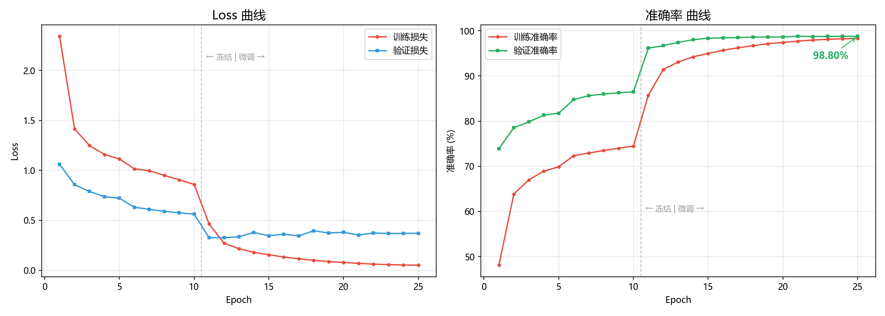
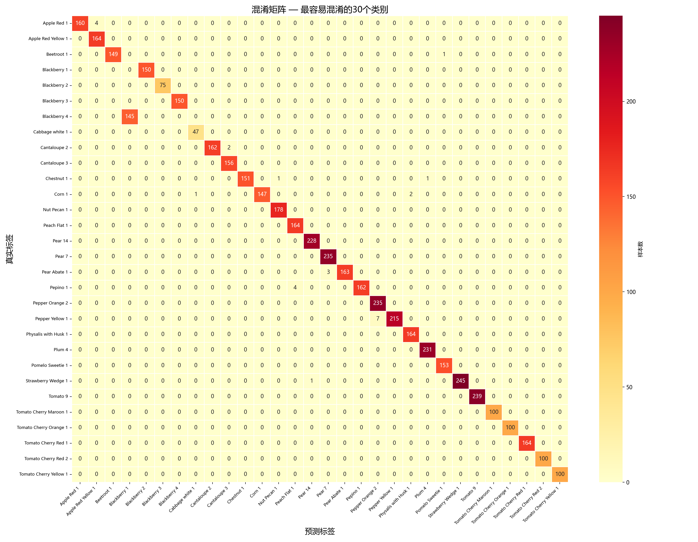
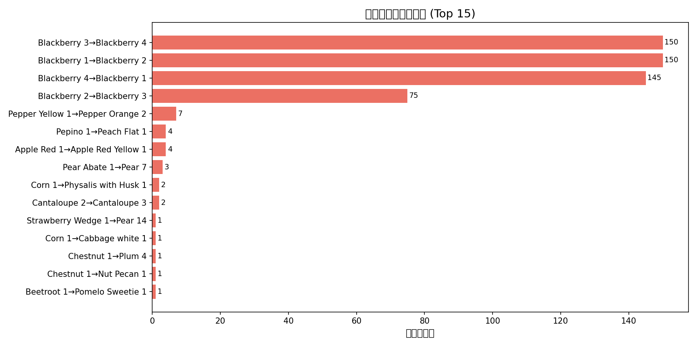

# 🍎 水果智能识别系统

基于 ResNet-18 迁移学习的 260 种水果蔬菜识别系统，测试集准确率 **98.80%**，集成 U²-Net 自动去背景 + Flask Web 部署。


---

## 📸 效果展示

| 不抠图（网图） | 抠图后 |
|:---:|:---:|
| ❌ 几乎全错 | ✅ 大幅提升 |

训练曲线：



---

## 🧠 技术方案

### 模型架构
- **ResNet-18** 迁移学习（ImageNet 预训练）
- 11M 参数，6GB 显存可训练
- 替换 FC 层为 260 类输出

### 两阶段训练策略

| 阶段 | Epochs | 策略 | 学习率 | 准确率 |
|------|--------|------|--------|--------|
| Stage 1 冻结训练 | 10 | 冻结卷积层，只训 FC | fc: 0.001 (StepLR) | 85.64% |
| Stage 2 微调 | 15 | 解冻 layer3+layer4，分层学习率 | fc: 5e-4, layer4: 1e-4, layer3: 5e-5 (CosineAnnealing) | **98.80%** |

### 数据增强
`RandomResizedCrop(224)` + `RandomHorizontalFlip` + `RandomRotation(±20°)` + `ColorJitter(0.3)`

### 推理管线
```
用户上传图片 → U²-Net 去背景 → 贴白底 → Resize(256) → CenterCrop(224) → Normalize → ResNet-18 → Top-5 结果
```

---

## 📁 项目结构

```
Fruits-360/
├── model.py                  # ResNet-18 迁移学习模型定义
├── train.py                  # 完整两阶段训练脚本
├── train_resume.py           # 续训脚本（从 Stage1 checkpoint 继续）
├── evaluate.py               # 模型评估（混淆矩阵 + 分类报告）
├── app.py                    # Flask Web 应用（集成 rembg 抠图）
├── generate_report.py        # 设计报告 .docx 生成脚本
├── templates/
│   └── index.html            # 前端识别界面（拖拽上传 + Top-5 展示）
├── best_model_stage1.pth     # Stage1 最优模型（85.64%）
├── class_names.txt           # 260 类水果名称映射
├── training_curve.png        # 训练 Loss + Accuracy 曲线
├── confusion_matrix.png      # 混淆矩阵热力图
└── top_errors.png            # 易混淆类别 Top-15 排行
```

> 注：训练数据 `data/` 和最终模型 `best_model.pth` 因体积过大未纳入仓库，可通过 `train.py` 重新生成。

---

## 🚀 快速开始

### 环境要求

- Python 3.10+
- PyTorch 2.0+ (CUDA 推荐)
- 6GB+ GPU 显存（CPU 也可训练，但较慢）

### 安装依赖

```bash
pip install torch torchvision flask rembg onnxruntime scikit-learn matplotlib seaborn pillow
```

### 下载数据集

从 Kaggle 下载 [Fruits-360](https://www.kaggle.com/datasets/moltean/fruits) 数据集，解压到 `data/` 目录：

```
data/
└── fruits-360_100x100/
    └── fruits-360/
        ├── Training/   # 137,221 张
        └── Test/       # 45,724 张
```

### 训练模型

```bash
# 从头训练（约 1.5-2 小时，RTX 4050）
python train.py

# 或从 Stage1 checkpoint 续训（约 1 小时）
python train_resume.py
```

### 启动 Web 应用

```bash
python app.py
# 访问 http://localhost:5000
```

上传图片 → 自动去背景 → 识别 → Top-5 结果展示。

---

## 📊 模型评估

| 指标 | 数值 |
|------|------|
| 测试集准确率 | **98.80%** |
| 加权平均 F1 | 0.99 |
| 宏平均 F1 | 0.98 |
| 测试集样本数 | 45,724 |





---

## 🔬 领域偏移分析与改进

### 问题发现

模型在 Fruits-360 标准测试集上达到 98.80%，但在真实网络图片上几乎全部识别错误。分析定位为 **领域偏移（Domain Shift）** 三个层面：

| 层面 | 训练集 | 真实图片 |
|------|--------|----------|
| 背景 | 纯白背景 | 桌面/天空/树枝等复杂背景 |
| 构图 | 水果居中、占画面主导 | 水果可能偏角落、比例小 |
| 对象 | 单个水果 | 多水果/果盘/树上多颗果实 |

### 解决方案与验证

引入 **U²-Net 自动去背景**作为预处理，对比实验结果：

| 测试场景 | 不抠图 Top-1 | 抠图后 Top-1 | 抠图后 Top-3 |
|----------|:-----------:|:----------:|:----------:|
| Fruits-360 原图 | 6/6 ✅ | 6/6 ✅ | — |
| 合成纹理背景 (7张) | 2/7 ✅ | 6/7 ✅ | — |
| Unsplash 真实照片 (4张) | 0/4 ✅ | 2/4 ✅ | 3/4 ✅ |

抠图有效缓解了背景差异问题，但多目标和场景差异需要通过扩充训练数据或目标检测架构解决。

---

## 📝 项目局限

1. **数据集域偏差**：Fruits-360 仅包含白底单果图，模型对多水果、自然场景泛化不足
2. **标签噪声**：部分类别标注不一致（如 BlackBerry/Blackberry），影响少量类别表现
3. **封闭类别**：仅识别 260 种预设水果蔬菜，不具备开放域识别能力
4. **推理延迟**：rembg 抠图每次约 2-5 秒，不适合实时视频场景

---

## 🔮 改进方向

- **短期**：优化抠图速度（换轻量分割模型如 IS-Net）
- **中期**：训练集混入带背景数据，标签清洗
- **长期**：转向目标检测架构（YOLO/Faster R-CNN），支持多水果识别

---

## 📄 许可

本项目仅用于学习交流。数据集 Fruits-360 版权归原作者所有。

---

## 👤 作者

Tristan Dure — 广东技术师范大学 计算机科学学院
